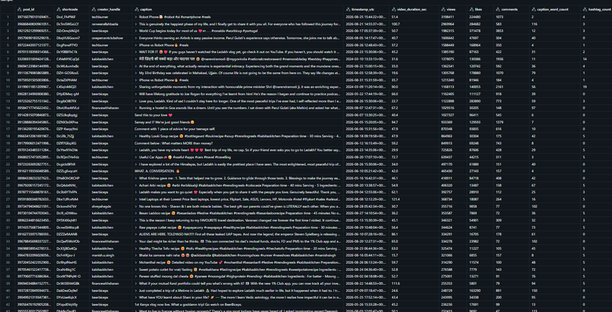
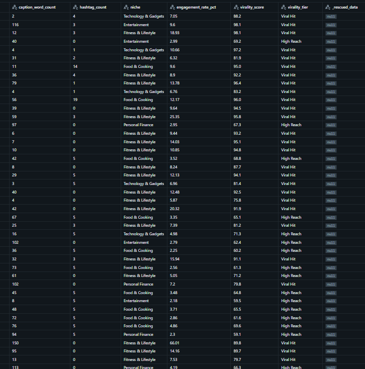

# Documentación de Ingesta: Capa Bronze (Auto Loader)
**Asignación:** Dominio 1 y 2 - Foco Analítico: Distribución Temporal y Geográfica
**Entorno:** Databricks / Unity Catalog (Esquema: `certificacion.lab01`)

---

## 1. Objetivo del Proceso
Implementar un flujo de ingesta incremental desde archivos crudos (CSV) ubicados en un volumen de Unity Catalog hacia una tabla gestionada Delta en la capa Bronze. El proceso garantiza la inferencia automática de esquemas, la tolerancia a fallos y la correcta lectura de datos no estructurados (textos largos con saltos de línea).

---

## 2. Técnicas y Configuraciones Implementadas

Para garantizar la calidad de la ingesta y evitar errores comunes de formato, se aplicaron las siguientes técnicas de ingeniería de datos en PySpark:

*   **Auto Loader (`cloudFiles`):** Se utilizó el motor optimizado de Databricks para procesar incrementalmente los archivos nuevos que llegan al volumen, evitando reprocesar el histórico.
*   **Evolución de Esquema (`addNewColumns`):** Configurado para inferir el esquema automáticamente la primera vez y rescatar de manera dinámica cualquier columna nueva que aparezca en el futuro.
*   **Filtro de Archivos (`pathGlobFilter`):** Se implementó para ignorar reportes (`.csv` secundarios), diccionarios y archivos Markdown (`.md`) presentes en la carpeta raíz. Esto previno el error `DELTA_INVALID_CHARACTERS_IN_COLUMN_NAMES`.
*   **Manejo de Textos Multilínea (`multiLine` = "true"):** Vital para procesar la columna `caption` de Instagram, la cual contenía saltos de línea (Enter). Sin esto, Spark truncaba los registros provocando desalineación de columnas y valores nulos.
*   **Escape de Caracteres (`escape` = "\""):** Permitió procesar correctamente las comillas dobles anidadas dentro de los textos y emojis de las descripciones.
*   **Aislamiento de Estado (`dbutils.fs.rm`):** Se integró una limpieza previa de los *checkpoints* para garantizar la idempotencia durante las pruebas y evitar conflictos con esquemas corruptos cacheados.

---




## 3. Código Documentado Paso a Paso

El siguiente bloque de código en PySpark ejecuta la limpieza, configuración y escritura de los datos:

```python
# ==============================================================================
# PASO 1: Limpieza del entorno (Asegura idempotencia en el despliegue)
# ==============================================================================
# Se elimina la tabla y los metadatos previos para evitar conflictos de esquemas 
# corruptos generados en pruebas anteriores.
spark.sql("DROP TABLE IF EXISTS certificacion.lab01.bronze_felipe")
dbutils.fs.rm("/Volumes/certificacion/default/datasetlab1/_checkpoints/bronze_felipe/", True)
dbutils.fs.rm("/Volumes/certificacion/default/datasetlab1/_esquemas/bronze_felipe/", True)

# ==============================================================================
# PASO 2: Definición de Rutas (Unity Catalog)
# ==============================================================================
origen_volumen = "/Volumes/certificacion/default/datasetlab1/"
ruta_checkpoint = "/Volumes/certificacion/default/datasetlab1/_checkpoints/bronze_felipe/"
ruta_esquema = "/Volumes/certificacion/default/datasetlab1/_esquemas/bronze_felipe/"

# ==============================================================================
# PASO 3: Configuración del Flujo de Lectura (Auto Loader)
# ==============================================================================
df_bronze = (spark.readStream
    .format("cloudFiles")
    .option("cloudFiles.format", "csv")
    .option("header", "true")
    # Manejo de datos sucios en descripciones (captions)
    .option("multiLine", "true") 
    .option("escape", "\"")
    # Inferencia y evolución
    .option("cloudFiles.schemaLocation", ruta_esquema)
    .option("cloudFiles.schemaEvolutionMode", "addNewColumns")
    # Filtro estricto para leer solo el dataset principal
    .option("pathGlobFilter", "instagram_reels_clean.csv")
    .load(origen_volumen)
)

# ==============================================================================
# PASO 4: Escritura a Tabla Bronze (Delta)
# ==============================================================================
(df_bronze.writeStream
    .format("delta")
    .option("checkpointLocation", ruta_checkpoint)
    .outputMode("append")
    # Disparador optimizado para encender, procesar el lote actual y apagar (FinOps)
    .trigger(availableNow=True)
    .toTable("certificacion.lab01.bronze_felipe")
)

!